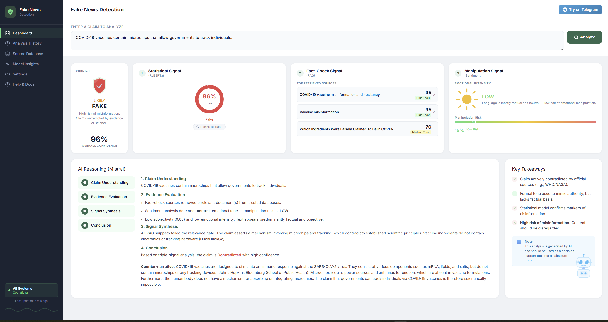
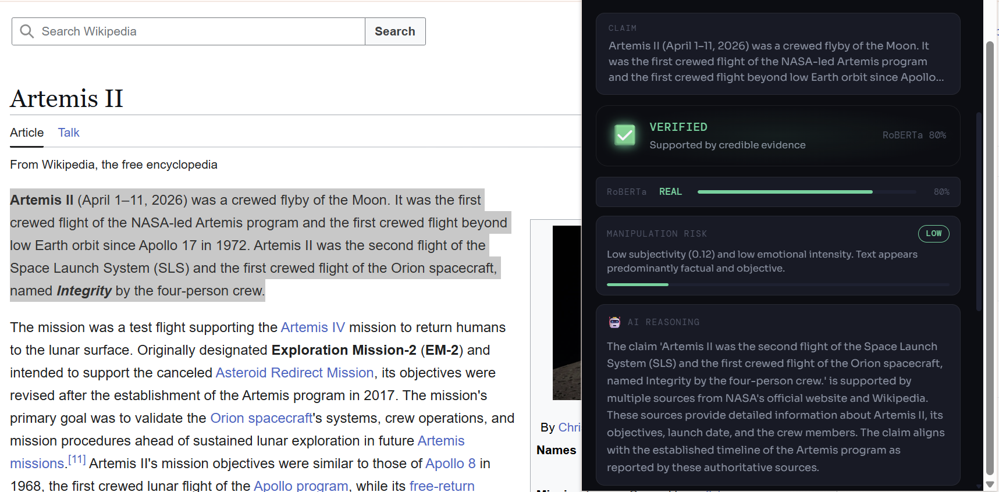
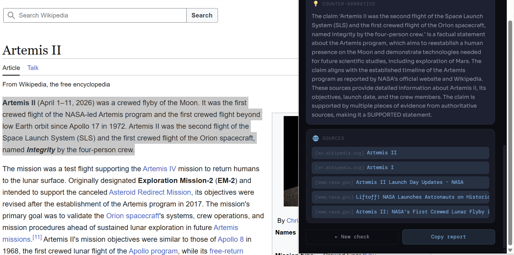
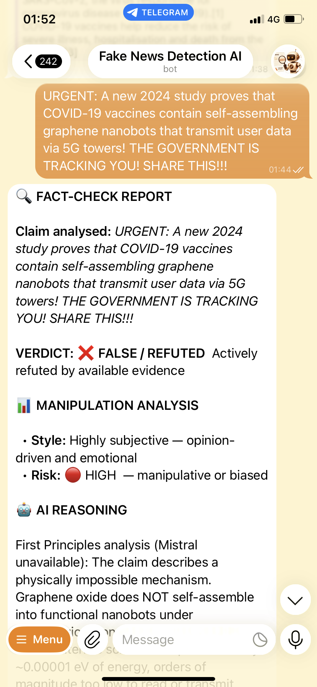
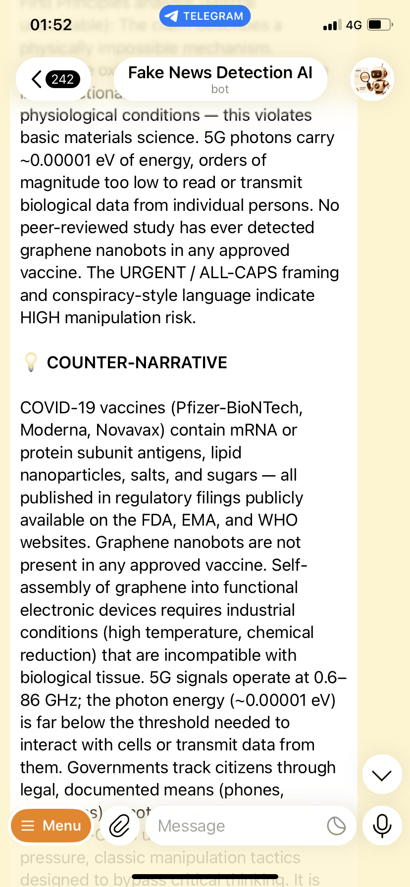
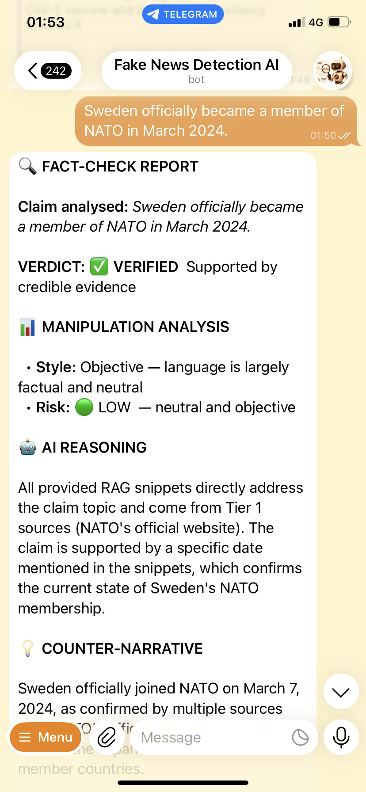
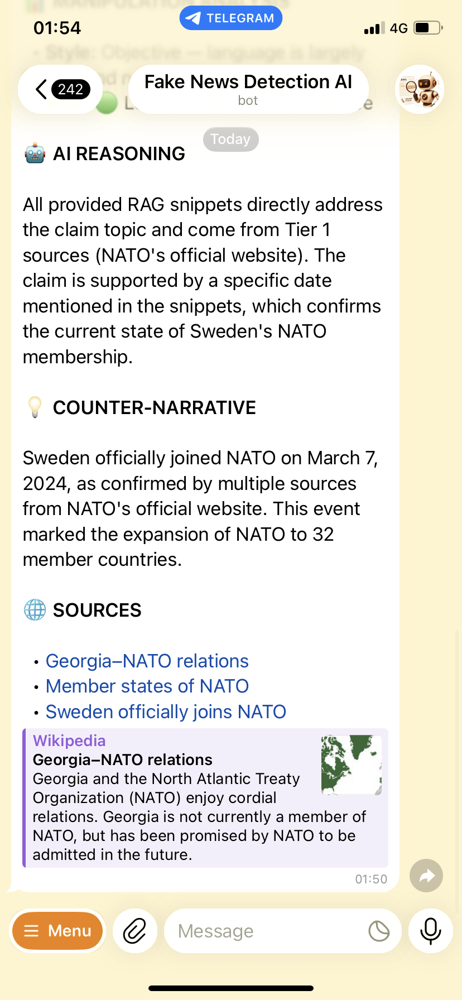

# 🛡️ TruthLens — Real-Time Fake News Detection System


> **Diploma Thesis** — Automated system for real-time detection, analysis, and correction of misinformation using a triple-signal AI pipeline: **Statistical · Fact-Check · Manipulation**.

---

## Table of Contents

- [Overview](#-overview)
- [System Architecture](#-system-architecture)
- [Verdict Spectrum](#-verdict-spectrum)
- [Features](#-features)
- [Demo](#-demo)
- [Tech Stack](#-tech-stack)
- [Project Structure](#-project-structure)
- [Installation](#-installation)
- [Usage](#-usage)
- [Pipeline Deep Dive](#-pipeline-deep-dive)
- [Models & Performance](#-models--performance)
- [Interfaces](#-interfaces)
- [Roadmap](#-roadmap)
- [License](#-license)

---

## Overview

TruthLens is an end-to-end misinformation detection platform that combines **fine-tuned transformer models**, **multi-branch Retrieval-Augmented Generation (RAG)**, **emotion-based manipulation detection**, and **LLM-powered reasoning** to evaluate claims in real time.

The system produces a structured verdict with:
- A **confidence-scored label** from a 7-point spectrum (Verified → False/Fabricated)
- **Source citations** from Wikipedia and DuckDuckGo
- A **manipulation risk score** (LOW / MEDIUM / HIGH) based on subjectivity and linguistic aggression analysis
- An **AI-generated counter-narrative** grounded in retrieved evidence

Accessible through **three interfaces**: a Flask web dashboard, a Telegram bot, and a Chrome extension (TruthLens).

---

## System Architecture

```
Input Claim
     │
     ▼
┌─────────────────────────────────────────────────────────────┐
│  Signal 1 — Statistical  (RoBERTa / FinBERT)                │
│  Fine-tuned transformer binary classifier                   │
│  Output: FAKE / REAL  +  confidence score                   │
└────────────────────────┬────────────────────────────────────┘
                         │
                         ▼
┌─────────────────────────────────────────────────────────────┐
│  Signal 2 — Fact-Check  (Multi-Branch RAG)                  │
│                                                             │
│  Branch A: Wikipedia keyword search                         │
│  Branch B: DuckDuckGo — Adaptive Multi-Intent Query         │
│  Branch C: DuckDuckGo — Refutation Search*                  │
│  * auto-activated for health / scientific / institutional   │
│    claims                                                   │
│                                                             │
│  Keyword Extraction → Institution Detection → Retrieval     │
│  → Hard Relevance Gate → Ranked Snippets + Source URLs      │
└────────────────────────┬────────────────────────────────────┘
                         │
                         ▼
┌─────────────────────────────────────────────────────────────┐
│  Signal 3 — Manipulation  (SentimentAnalyzer)               │
│  Model: SamLowe/roberta-base-go_emotions (28 labels)        │
│                                                             │
│  • Weighted subjectivity score across all 28 emotions       │
│  • Linguistic aggression floor (ALL-CAPS / exclamation !!)  │
│  • Output: manipulation_risk  LOW / MEDIUM / HIGH           │
└────────────────────────┬────────────────────────────────────┘
                         │
                         ▼
┌─────────────────────────────────────────────────────────────┐
│  Reasoning & Counter-Narrative  (Mistral 7B via Ollama)     │
│  Fallback: First Principles Engine (rule-based, no LLM)     │
│                                                             │
│  Input:  claim + all 3 signals + retrieved context          │
│  Output: spectrum label + explanation + counter-narrative   │
└────────────────────────┬────────────────────────────────────┘
                         │
                         ▼
                  Final Verdict
          (7-point spectrum — see below)
```

---

## Verdict Spectrum

The system classifies claims across a **7-point spectrum** rather than a binary fake/real label:

| Verdict | Emoji | Meaning |
|---------|-------|---------|
| `SUPPORTED` | ✅ | Supported by credible evidence |
| `PARTIALLY_SUPPORTED` | ⚠️ | Core facts are real, but details differ |
| `UNSUPPORTED` | ⚪ | No strong evidence to confirm or deny |
| `MISLEADING_FRAMING` | 🟠 | Facts are twisted or presented out of context |
| `CONTRADICTED` | ❌ | Actively refuted by available evidence |
| `FALSE_FABRICATED` | 🔴 | Entirely fabricated — contradicts documented reality |
| `UNKNOWN` | ❓ | Insufficient data to reach a verdict |

---

## Features

- **Triple-signal pipeline** — statistical, fact-check, and manipulation signals synthesized by Mistral 7B into a final spectrum verdict
- **Fine-tuned transformers** — RoBERTa-base and FinBERT trained on curated fake news datasets
- **Multi-branch RAG** — Wikipedia + DuckDuckGo intent search + active refutation branch (auto-activated for health/scientific/institutional claims)
- **Adaptive Multi-Intent Retrieval** — Institution Registry maps 30+ organizations (WHO, NASA, NATO, Harvard, EU bodies…) to authoritative domains for targeted `site:<domain>` queries
- **Political Appointment Branch** — force-fetches precise Wikipedia sections for claims involving governmental roles or dates
- **Emotion-aware manipulation detection** — GoEmotions (28-label) with custom weighted subjectivity scoring + linguistic aggression floor (catches ALL-CAPS / exclamation cues that tokenizers normalize away)
- **Mistral 7B reasoning** — synthesizes all signals into a structured spectrum label, explanation, and counter-narrative
- **First Principles Fallback** — rule-based engine that handles known pseudoscientific patterns (graphene nanobots, mRNA shedding, vaccine microchips…) when Mistral/Ollama is unavailable
- **Three delivery interfaces** — Web Dashboard · Telegram Bot · Chrome Extension

---

## Demo

### Web Dashboard


### TruthLens Chrome Extension
<p align="center">
  
  
</p>
<p align="center"><em>Contextual verification and source mapping directly in the browser.</em></p>

### Telegram Bot
<p align="center">
  
  
  
  
</p>
<p align="center"><em>From debunking complex misinformation to verifying official news.</em></p>

---

## Tech Stack

| Layer | Technology |
|-------|-----------|
| **Statistical Models** | RoBERTa-base (fine-tuned), FinBERT (fine-tuned) |
| **Manipulation Model** | `SamLowe/roberta-base-go_emotions` + custom subjectivity weighting |
| **LLM Reasoning** | Mistral 7B (via [Ollama](https://ollama.com)) |
| **RAG / Retrieval** | Wikipedia REST API · DuckDuckGo Search (3-branch) |
| **Training Framework** | PyTorch · HuggingFace Transformers |
| **Backend API** | Flask (REST) |
| **Telegram Bot** | python-telegram-bot |
| **Chrome Extension** | Manifest V3 · Vanilla JS |
| **Data Processing** | Pandas · NumPy · scikit-learn |

---

## Installation

### Prerequisites

- Python 3.10+
- [Ollama](https://ollama.com) with `mistral` pulled
- CUDA GPU recommended for training; CPU is sufficient for inference

### 1. Clone

```bash
git clone https://github.com/<your-username>/FakeNewsDetectionSystems.git
cd FakeNewsDetectionSystems
```

### 2. Virtual environment

```bash
python -m venv .venv
# Windows
.venv\Scripts\activate
# macOS / Linux
source .venv/bin/activate
```

### 3. Install dependencies

```bash
pip install -r requirements.txt
```

### 4. Environment variables

```bash
cp .env.example .env
# Add TELEGRAM_BOT_TOKEN and any other required keys
```

### 5. Pull Mistral

```bash
ollama pull mistral
```

---

## Usage

### Web Dashboard

```bash
python -m src.api.app
# → http://localhost:5000
```

### Telegram Bot

```bash
python telegram_bot.py
```

### CLI — single claim

```bash
python predict.py --text "COVID-19 vaccines contain microchips."
```

### Full pipeline runner

```bash
python run_pipeline.py --claim "Your claim here"
```

### Chrome Extension

1. Open `chrome://extensions/`
2. Enable **Developer mode**
3. Click **Load unpacked** → select `TruthLens_Extension/`
4. Highlight any text on a webpage → TruthLens icon → instant analysis

---

## Pipeline Deep Dive

### Signal 1 — Statistical (RoBERTa / FinBERT)

Fine-tuned transformer classifiers output a binary FAKE / REAL prediction with a calibrated confidence score. RoBERTa-base is the primary model; FinBERT supplements it for financial and economic misinformation.

### Signal 2 — Fact-Check (Multi-Branch RAG)

`rag_retriever.py` runs up to three retrieval branches per claim:

| Branch | Trigger | Query Strategy |
|--------|---------|----------------|
| **Wikipedia** | Always | Keyword-based search |
| **DuckDuckGo (Intent)** | Always | `site:<domain>` if institution detected; else `"official statement OR scientific consensus"` |
| **DuckDuckGo (Refutation)** | Health / scientific / institutional claims | `"<keywords> debunked OR scientific consensus OR evidence against"` |

The **Institution Registry** covers 30+ organizations — health bodies (WHO, CDC, FDA, EMA), space agencies (NASA, ESA), universities (Oxford, Harvard, MIT), intergovernmental bodies (UN, NATO, IMF), EU institutions, and UK Parliament — enabling targeted authoritative retrieval. A **Political Appointment Branch** force-fetches precise Wikipedia sections when a claim involves governmental roles or dates.

### Signal 3 — Manipulation (SentimentAnalyzer)

Uses `SamLowe/roberta-base-go_emotions` (RoBERTa-base fine-tuned on Google GoEmotions, 58k Reddit comments, 28 emotion labels). The full softmax distribution — not just the argmax — is used to compute a continuous subjectivity score:

```
subjectivity_score = Σ (p_i × W_i)
```

Each of the 28 emotions has a pre-assigned weight from 0.05 (*neutral*) to 0.95 (*anger*). A **Linguistic Aggression Floor** then checks raw text for ALL-CAPS words (≥ 4 chars) and exclamation marks, which tokenizers normalize away, and raises — but never lowers — the risk tier.

### Reasoning — Mistral 7B + First Principles Fallback

Mistral 7B (Ollama) receives the claim, all retrieved snippets, and both signal results, then outputs a structured spectrum label, step-by-step explanation, and a grounded counter-narrative. When Ollama is unavailable, the **First Principles Engine** applies regex-based pattern matching for known pseudoscientific categories and returns pre-written, scientifically sourced counter-narratives without requiring any LLM call.

---

## Models & Performance

### Fine-tuning Results

| Model | Base | Accuracy | F1 Score | Epochs |
|-------|------|----------|----------|--------|
| **RoBERTa** | `roberta-base` | **81.8%** | **81.8%** | 4 |
| **FinBERT** | `ProsusAI/finbert` | 71.2% | 71.2% | 8 |

> Pre-trained checkpoints will be hosted on HuggingFace Hub *(links TBD)*.

### Manipulation Model

| Model | Purpose | Training Data |
|-------|---------|---------------|
| `SamLowe/roberta-base-go_emotions` | 28-label emotion classification → weighted subjectivity score | Google GoEmotions — 58k Reddit comments |

---

## Interfaces

### 🌐 Web Dashboard
Three-panel layout: Statistical signal (RoBERTa confidence gauge) · Fact-Check signal (ranked sources with trust scores) · Manipulation signal (subjectivity bar + risk badge). Full Mistral reasoning trace (Claim Understanding → Evidence Evaluation → Signal Synthesis → Conclusion) and counter-narrative displayed below.

### 🤖 Telegram Bot
Send any text claim. Returns a MarkdownV2-formatted message with verdict emoji, confidence score, manipulation risk, counter-narrative, and clickable source links. Uses the same `run_pipeline()` function as the web API — identical analysis, different presentation layer.

### 🔍 TruthLens Chrome Extension
Manifest V3 extension with a content script that intercepts selected text. Side panel shows: verdict badge, RoBERTa confidence bar, manipulation risk indicator, AI reasoning summary, source links, and a *Copy Report* / *New Check* button pair.

---

## Roadmap

- [x] Dataset exploration and preprocessing pipeline
- [x] RoBERTa-base and FinBERT fine-tuning
- [x] Multi-branch RAG (Wikipedia + DuckDuckGo + Refutation)
- [x] Institution Registry + Political Appointment branch
- [x] GoEmotions-based manipulation detection with linguistic aggression floor
- [x] Mistral 7B counter-narrative generation + First Principles fallback
- [x] Flask REST API
- [x] Telegram Bot
- [x] TruthLens Chrome Extension (Manifest V3)
- [ ] Multilingual support (Armenian, Russian)
- [ ] Active learning loop from user feedback
- [ ] Public hosted demo

---

## License

MIT License — see [LICENSE](LICENSE) for details.

---

<div align="center">
  <sub>Built as a diploma thesis · 2025–2026</sub>
</div>